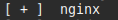
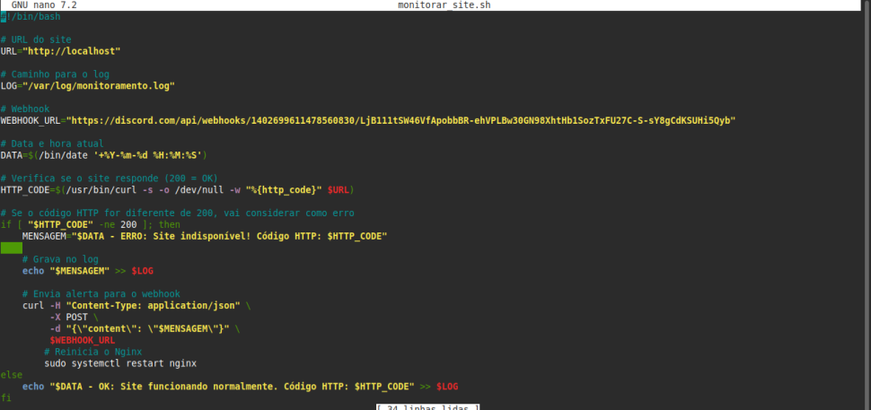
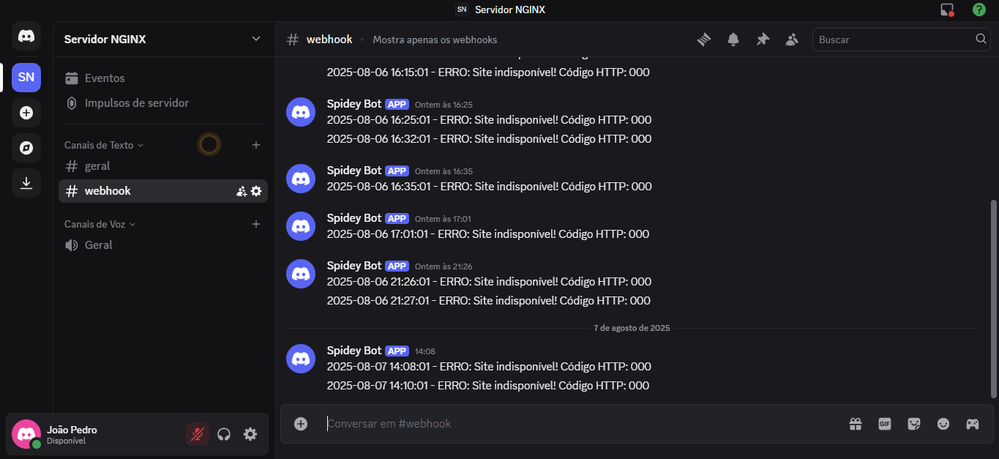

# Infraestrutua local
Projeto desenvolvido para simular uma infraestrutura com Nginx e monitoramento com alertas via webhook enviados no Discord. Feito localmente usando Linux (Mint) para o programa de bolsas da Compass UOL na trilha de DevSecOps e AWS.

# Pré-requisitos
Linux  
Nginx  
Cron  
Curl  
Shell Script  
Webhook  

# Etapas do projeto
Instalação do Nginx  
Criação da página HTML em "/var/www/html/index.html"  
Script que salva logs e envia um alerta apenas se o site cair  
Cron executando o script a cada minuto  

# Testes realizados
Parar e iniciar o serviço do Nginx  
Receber alertas no Discord via webhook  
Verificação de logs em "/var/log/monitoramento.log"  

# Prints
Nginx:   
Crontab:   
Script:   
Webhook:   
