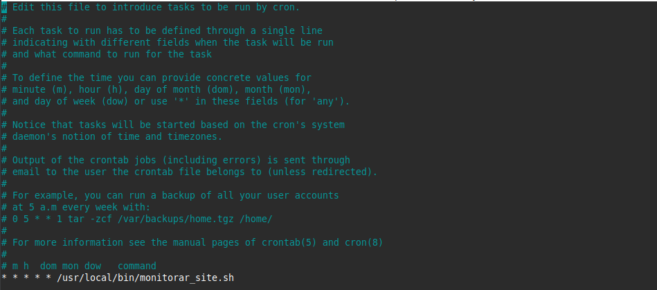

# Infraestrutura local
Projeto desenvolvido para simular uma infraestrutura com Nginx e monitoramento com alertas via webhook enviados no Discord. Feito localmente usando Linux (Mint) para o programa de bolsas da Compass UOL na trilha de DevSecOps e AWS.

# Pré-requisitos e guias
Lista dos Pré-requisitos junto dos guias: [Pré-requisitos e guias](pre_requisitos.md)  

# Etapas do projeto
Instalação do Nginx;  
Criação da página [HTML](index.html) em  
```/var/www/html/index.html```    
Criação de um [Script](monitorar_site.sh) em ```/usr/local/bin``` que salva logs, envia um alerta apenas se o site cair e reinicia o sistema;  
Dar permissão de execução ao script:  
```sudo chmod +x /usr/local/bin/monitorar_site.sh```  
Cron executando o script a cada minuto;  
Para abrir o cron:  
```crontab -e```  
Na última linha:  
```* * * * * * /usr/local/bin/monitorar_site.sh```  

# Testes realizados
Parar o serviço do Nginx;  
Receber alertas no Discord via webhook;  
Verificação de logs em:  
```/var/log/monitoramento.log```
# Prints
Nginx:   
Cron:   
Script:   
Webhook:   
